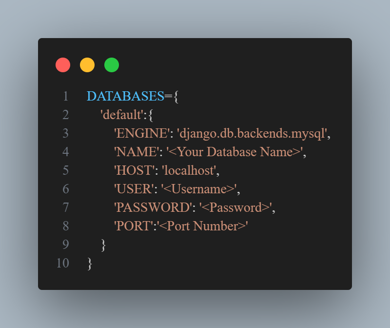

# Student Portal

## Description
The Student Portal is an advanced online platform designed to facilitate learning management and administrative tasks for educational institutions. Developed with a focus on user empowerment and administrative efficiency, the portal caters to students, teachers, and coordinators (admins), providing them with essential tools to manage their academic journey effectively.

## Key Features

1. **User Roles:**
   - **Student:** Access to course materials, lecture tracking, and self-learning progress monitoring.
   - **Teacher:** Ability to mark lectures as completed, manage course content, and track student engagement.
   - **Coordinator (Admin):** Comprehensive administrative control, including user management, batch/course creation, and system configuration.

2. **Lecture Tracking:**
   - **Teacher Perspective:** Teachers can mark lectures as completed for in-class sessions, ensuring accurate progress tracking.
   - **Student Perspective:** Students have the option to mark lectures they've completed through self-learning, allowing them to track their individual progress.

3. **User Management:**
   - **Admin Control:** Coordinators have the authority to add, activate, deactivate, or remove users (students, teachers) from the portal. They can also manipulate student data, including batch assignments and course enrollments.
   - **Batch Management:** Coordinators can create new batches or courses, facilitating the organization and management of academic programs.

## Technologies Used
- **Framework:** Django (Python)
- **Frontend:** HTML, CSS, JavaScript
- **Backend:** Python (Django)
- **Database:** MySQL

## Target Audience
The Student Portal caters to educational institutions of all levels, offering a scalable solution for student, teacher, and administrative management.

## Benefits
- Streamlines administrative tasks, including user management and batch/course creation.
- Enhances student engagement through lecture tracking and self-learning progress monitoring.
- Empowers teachers with tools to manage course completion and student engagement effectively.
- Provides coordinators with comprehensive control over system configuration and user management.

## Conclusion
The Student Portal is a dynamic solution designed to modernize and optimize educational operations, fostering collaboration and efficiency across all stakeholders. Whether you're a student striving for academic excellence, a teacher facilitating learning experiences, or a coordinator managing educational operations, the Student Portal empowers you to succeed in your academic endeavors.

### Dependencies
- Django
- MySql

### Steps for Installation
- clone the repository into your machine
- Install or Update Python
- Create a Database in the Mysql and add it in the settings.py file


- Install Django Framework
**For Windows and MacOs:-**
```bash
pip install django
```
**For Linux:-**
```bash
sudo pip install django
```
- Change the Directory to the Portal
- Make the migrations
```bash
python manage.py makemigrations
python manage.py migrate
```
- Run the Project
```bash
python manage.py runserver
```

### Creation of the Databa
After running the Project you need to add Data in the Data base for that you need to run the data creation query  
Enter the Following Url in the browser
http://127.0.0.1:port Number/createData  
After Runnig this command please comment the line  
path('createData',creatingCourseTopicAndSubTopic.uploadData)  
in the urls.py file present in the portalApp folder

Now you can login as admin and add Student and Teacher into the Database.
